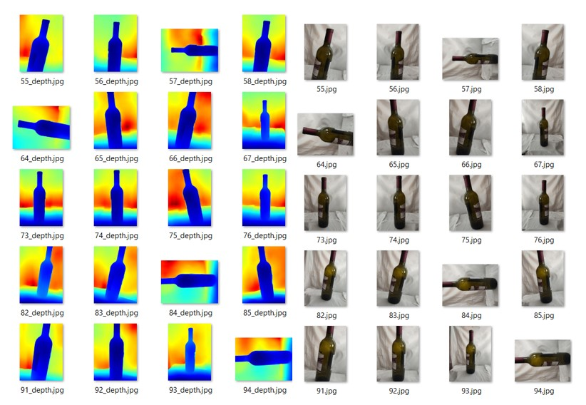
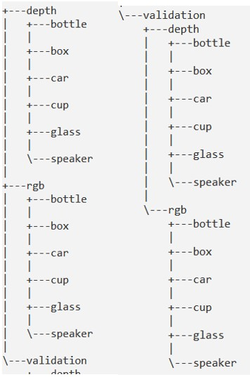
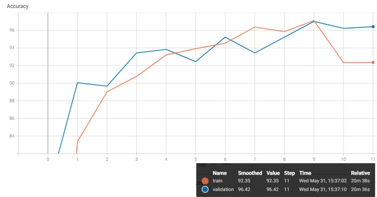
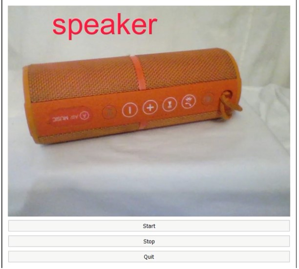
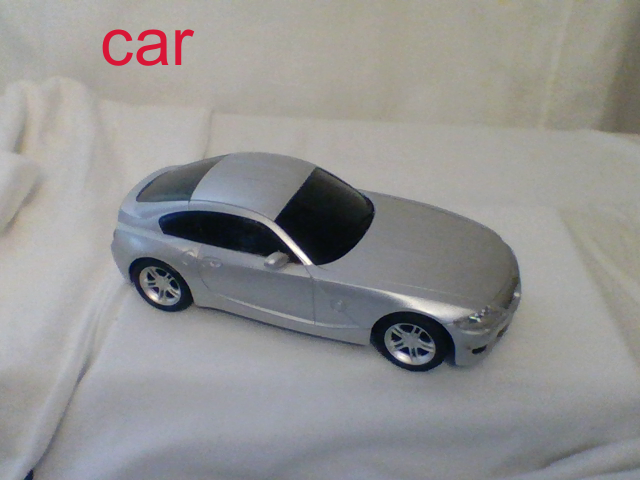
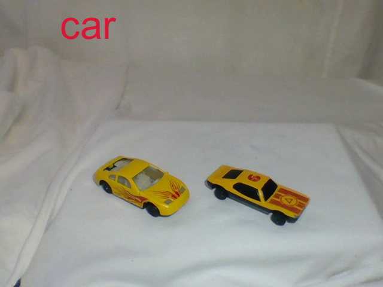
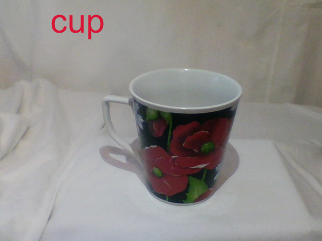
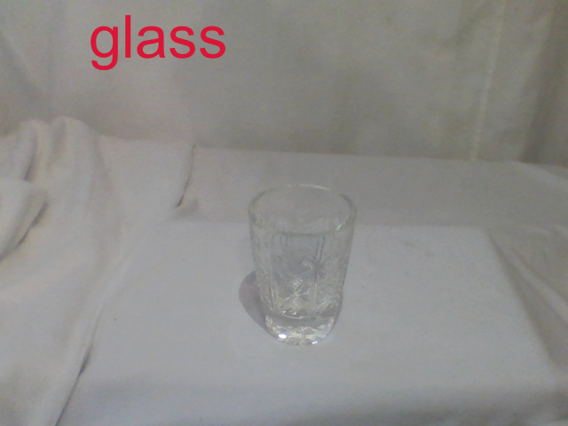

# Dual-channel_CNN
* Python
* PyTorch
* CNN models

Project on creating CNN models to compare the advantages of a dual-channel architecture over the standard one. An image classifier based on RGB and Depth integrated for working with the Realsense D535 stereo camera. 
### Dataset
A dataset was created to conduct the experiment, which included 6 classes of objects. The total number of image pairs amounted to 4500 (RGB+Depth).

### Train result
The training of the model was successful and showed high accuracy metrics (96%).

### Application example
A convenient application was created for working directly with the camera and the model.

### Recognition examples

